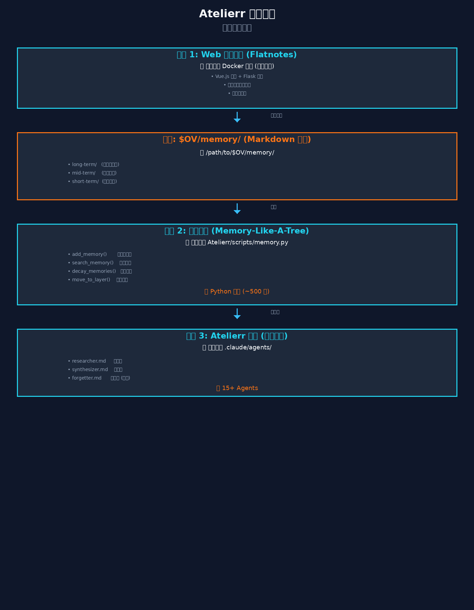
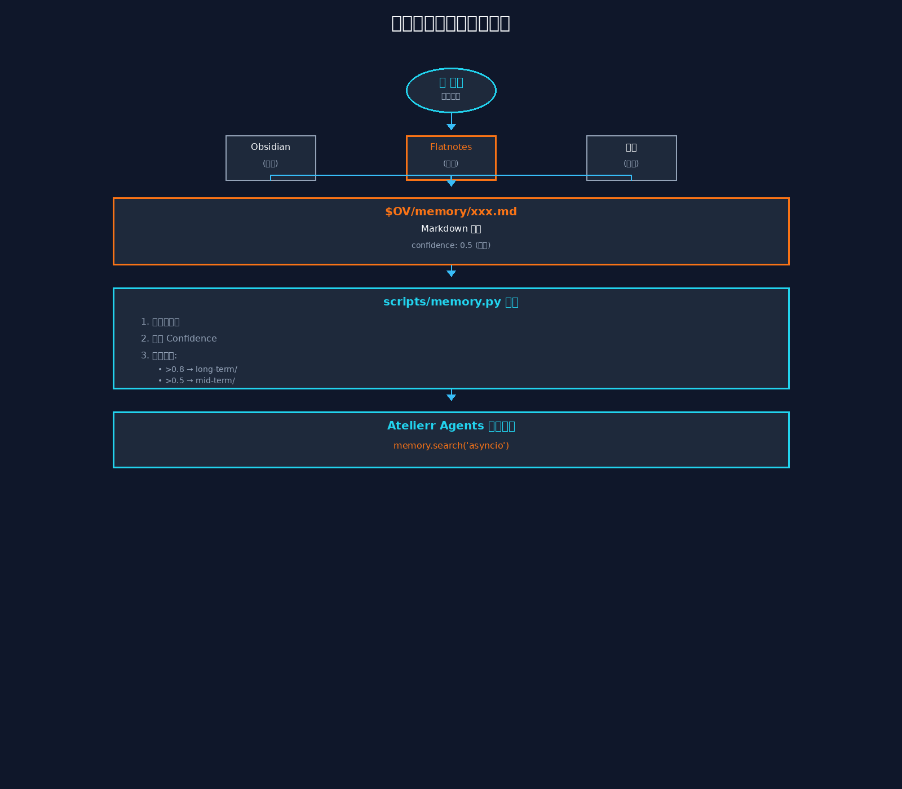
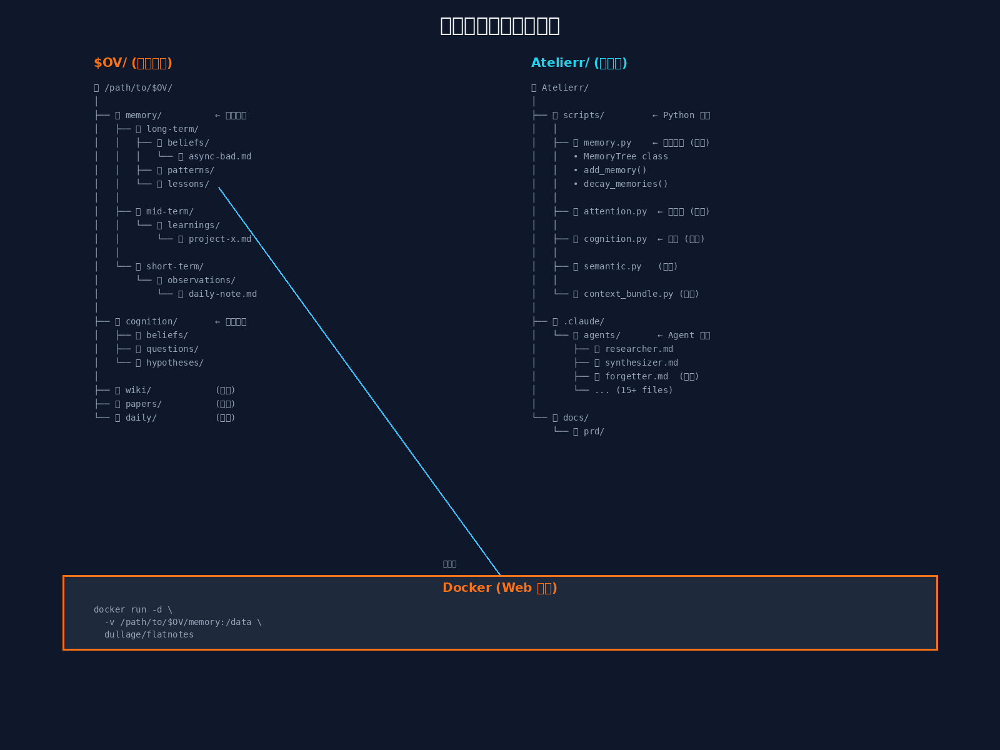

# 图解：Atelierr 完整架构

## 📊 三张可视化图解

已创建三张图片帮助你理解架构：

### 1. 架构总览图



**这张图展示：**
- ✅ 三个独立模块的位置
- ✅ 每个模块在哪里（文件路径）
- ✅ 模块之间的关系

---

### 2. 数据流程图



**这张图展示：**
- ✅ 用户创建笔记的完整流程
- ✅ 数据如何从前端流向后端
- ✅ 记忆模块如何处理文件

---

### 3. 文件结构图



**这张图展示：**
- ✅ $OV/ 文件夹的结构（左侧）
- ✅ Atelierr/ 代码的结构（右侧）
- ✅ Docker 如何挂载文件夹

---

## 🎯 关键问题解答（用图说话）

### Q1: 记忆模块在哪里？

```
看图 1（架构总览）的"模块 2"：

📍 位置：Atelierr/scripts/memory.py

📦 内容：
   • add_memory()      → 创建新记忆
   • search_memory()   → 搜索记忆
   • decay_memories()  → 自动衰减
   • move_to_layer()   → 分配层级

💾 管理的文件：
   $OV/memory/
   ├── long-term/
   ├── mid-term/
   └── short-term/
```

### Q2: 认知模块在哪里？

```
看图 3（文件结构）：

📍 代码位置：Atelierr/scripts/cognition.py

📦 功能：
   • upgrade_to_belief()  → 升级到信念
   • generate_question()  → 生成问题
   • test_hypothesis()    → 测试假设

💾 存储位置：$OV/cognition/
   ├── beliefs/      → 信念
   ├── questions/    → 问题
   └── hypotheses/   → 假设
```

### Q3: Web 交互界面在哪里？

```
看图 1（架构总览）的"模块 1"：

📍 位置：Docker 容器（独立部署）

📦 项目：dullage/flatnotes (GitHub)

🚀 部署：
   docker run -d \
     -v /path/to/$OV/memory:/data \
     flatnotes

🌐 访问：https://memory.yourdomain.com
```

---

## 📝 简单总结

### 三个独立模块

```
┌─────────────────────────────────────────┐
│ 模块 1: Web 界面 (Flatnotes)           │
│ 📍 Docker 容器                          │
│ 🎯 提供网页访问                         │
└────────────┬────────────────────────────┘
             ↓ (读写文件)
┌─────────────────────────────────────────┐
│ 模块 2: 记忆模块 (Memory-Like-A-Tree)  │
│ 📍 scripts/memory.py                    │
│ 🎯 管理记忆生命周期                     │
└────────────┬────────────────────────────┘
             ↓ (被调用)
┌─────────────────────────────────────────┐
│ 模块 3: Atelierr 核心                   │
│ 📍 .claude/agents/                      │
│ 🎯 15+ Agents 协作                      │
└─────────────────────────────────────────┘
```

---

## 🔑 核心要点

### 1. 文件路径清单

```
记忆模块代码：
  ✅ Atelierr/scripts/memory.py     (新增)
  ✅ Atelierr/scripts/attention.py  (新增)
  ✅ Atelierr/scripts/cognition.py  (新增)

记忆数据存储：
  ✅ $OV/memory/long-term/    (高信心)
  ✅ $OV/memory/mid-term/     (中等)
  ✅ $OV/memory/short-term/   (临时)

认知数据存储：
  ✅ $OV/cognition/beliefs/     (信念)
  ✅ $OV/cognition/questions/   (问题)
  ✅ $OV/cognition/hypotheses/  (假设)

Agent 定义：
  ✅ .claude/agents/researcher.md    (现有)
  ✅ .claude/agents/synthesizer.md   (现有)
  ✅ .claude/agents/forgetter.md     (新增)

Web 界面：
  ✅ Docker 容器 (独立部署)
  ✅ 挂载到 $OV/memory/
```

### 2. 模块关系

```
用户 → Web 界面 (Flatnotes)
         ↓
    $OV/memory/*.md (Markdown 文件)
         ↓
    scripts/memory.py (记忆模块)
         ↓
    .claude/agents/ (Atelierr Agents)
```

### 3. 完全解耦

```
✅ Web 界面和记忆模块 → 完全独立
✅ 记忆模块和 Atelierr Core → 完全独立
✅ 通过文件系统通信 ($OV/memory/)
✅ 可以独立替换任何模块
```

---

## 📸 查看图片

请打开这三张图片查看：

1. **架构总览图**: `docs/prd/architecture-diagram.png`
   - 展示三个模块的位置和关系

2. **数据流程图**: `docs/prd/dataflow-diagram.png`
   - 展示用户创建笔记的完整流程

3. **文件结构图**: `docs/prd/file-structure-diagram.png`
   - 展示具体的文件夹和代码位置

---

**现在清楚了吗？😊**

如果还有任何困惑，请告诉我具体是哪个部分，我可以进一步解释！
