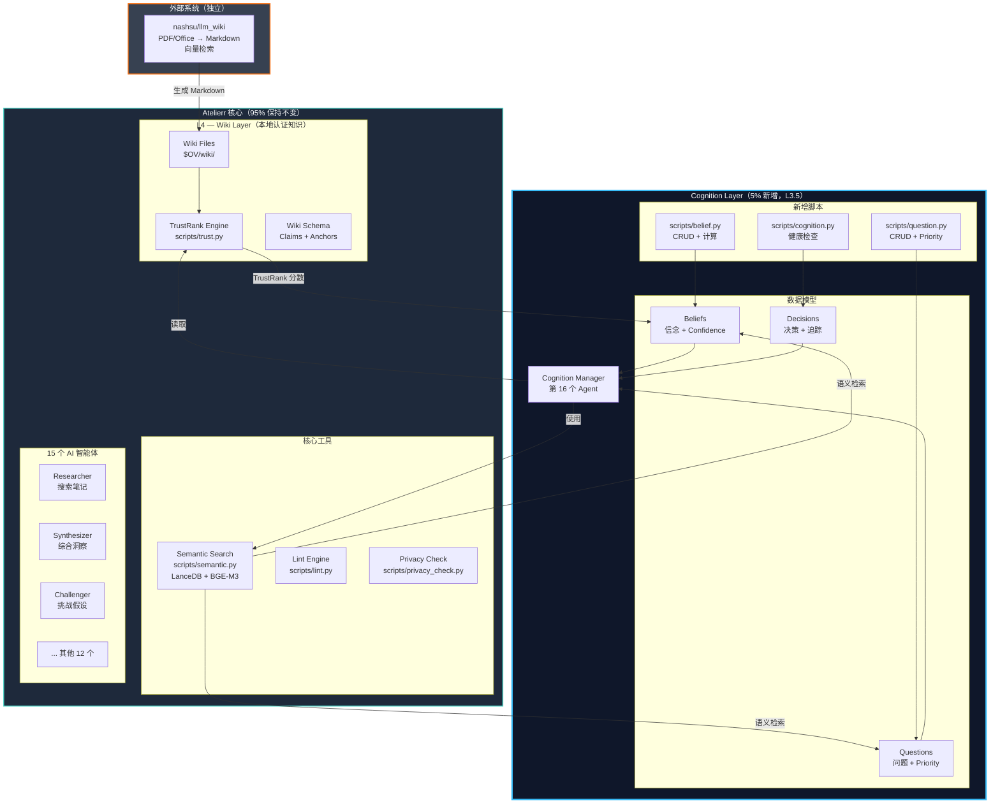
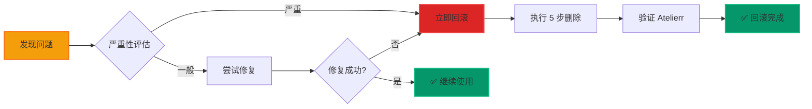

# 架构可视化 — Personal Intelligence System

**版本:** v1.0  
**日期:** 2026-08-27  
**目的:** 用图表清晰展示架构、模块边界、接口关系、解耦性

---

## 📊 目录

1. [整体架构图](#1-整体架构图)
2. [模块职责矩阵](#2-模块职责矩阵)
3. [接口关系图](#3-接口关系图)
4. [数据流图](#4-数据流图)
5. [解耦验证图](#5-解耦验证图)
6. [改动范围可视化](#6-改动范围可视化)

---

## 1. 整体架构图

### 1.1 系统分层视图



### 1.2 知识层次图（L1-L5 + L3.5）

```
┌─────────────────────────────────────────────────────────────┐
│  L5 — Foundation (reserved)                                  │
│       universally certified                                  │
└─────────────────────────────────────────────────────────────┘
                            ↑
                            │
┌─────────────────────────────────────────────────────────────┐
│  L4 — Wiki ($OV/wiki/) 【Atelierr 核心，不变】               │
│       locally certified, TrustRank-scored                   │
│                                                              │
│       • Wiki Schema (protocols/wiki-schema.md)              │
│       • Claims with [C1], [C2] markers                      │
│       • TrustRank Engine (scripts/trust.py)                 │
└─────────────────────────────────────────────────────────────┘
                            ↑
                            │ 引用 Claims
                            │
┏━━━━━━━━━━━━━━━━━━━━━━━━━━━━━━━━━━━━━━━━━━━━━━━━━━━━━━━━━━━┓
┃  L3.5 — Cognition ($OV/cognition/) 【新增层】               ┃
┃         structured thinking                                 ┃
┃                                                              ┃
┃       • Beliefs (基于 Wiki Claims)                          ┃
┃       • Questions (待解决问题)                               ┃
┃       • Decisions (决策追踪)                                 ┃
┃       • Confidence 自动计算                                  ┃
┗━━━━━━━━━━━━━━━━━━━━━━━━━━━━━━━━━━━━━━━━━━━━━━━━━━━━━━━━━━━┛
                            ↑
                            │ 证据来源
                            │
┌─────────────────────────────────────────────────────────────┐
│  L3 — Papers ($OV/papers/, $OV/preprints/)                  │
│       peer-reviewed, externally certified                   │
└─────────────────────────────────────────────────────────────┘
                            ↑
                            │
┌─────────────────────────────────────────────────────────────┐
│  L2 — Working notes                                          │
│       $OV/daily-notes/, $OV/reflections/                    │
└─────────────────────────────────────────────────────────────┘
                            ↑
                            │
┌─────────────────────────────────────────────────────────────┐
│  L1 — Raw capture                                            │
│       $OV/inbox/, $OV/cache/                                │
└─────────────────────────────────────────────────────────────┘
```

---

## 2. 模块职责矩阵

### 2.1 Atelierr 核心模块（保持不变）

| 模块 | 职责 | 输入 | 输出 | 状态 |
|------|------|------|------|------|
| **Trust Engine** | 计算 Wiki TrustRank | Wiki Markdown + Claims | TrustRank 分数 (0-1) | ✅ 不变 |
| **Semantic Search** | 语义检索 | Query + 向量 DB | 相关文档列表 | ✅ 不变 |
| **Wiki Layer (L4)** | 结构化知识存储 | Papers + Notes | Wiki Markdown | ✅ 不变 |
| **15 个 Agents** | 反思、综合、阅读... | 用户输入 + 知识库 | 洞察 + 报告 | ✅ 不变 |
| **Lint Engine** | 结构检查 | Markdown 文件 | 错误报告 | ✅ 不变 |
| **Privacy Check** | 隐私审查 | Markdown 文件 | 隐私风险列表 | ✅ 不变 |

### 2.2 Cognition Layer 模块（新增）

| 模块 | 职责 | 输入 | 输出 | 依赖 Atelierr |
|------|------|------|------|---------------|
| **Belief Manager** | CRUD Beliefs | Belief Markdown | Beliefs 数据 | trust.py (TrustRank) |
| **Question Tracker** | CRUD Questions | Question Markdown | Questions 数据 | semantic.py (检索) |
| **Decision Tracker** | CRUD Decisions | Decision Markdown | Decisions 数据 | — |
| **Cognition Manager** | 自动计算 Confidence/Priority | Beliefs + Questions | 计算结果 | trust.py + semantic.py |
| **Health Checker** | 检测认知异常 | Cognition 数据 | 健康报告 | cues.py (框架) |

---

## 3. 接口关系图

### 3.1 单向依赖关系（解耦关键）

```mermaid
graph LR
    subgraph Atelierr["Atelierr 核心（不感知 Cognition）"]
        TE[Trust Engine<br/>scripts/trust.py]
        SS[Semantic Search<br/>scripts/semantic.py]
        Wiki[Wiki Layer<br/>$OV/wiki/]
    end
    
    subgraph Cognition["Cognition Layer（依赖 Atelierr）"]
        BM[Belief Manager<br/>scripts/belief.py]
        QT[Question Tracker<br/>scripts/question.py]
        CogMgr[Cognition Manager<br/>Agent]
    end
    
    BM -->|读取 TrustRank| TE
    QT -->|使用语义检索| SS
    CogMgr -->|读取 TrustRank| TE
    CogMgr -->|使用语义检索| SS
    BM -->|引用 Claims| Wiki
    
    style Atelierr fill:#1E293B,stroke:#4FD1C5,stroke-width:3px
    style Cognition fill:#0F172A,stroke:#38BDF8,stroke-width:3px
```



**关键特性：**
- ✅ **单向依赖**：Cognition → Atelierr，Atelierr 不感知 Cognition
- ✅ **只读访问**：Cognition 只读取 Atelierr 的输出，不修改
- ✅ **完全解耦**：删除 Cognition 后，Atelierr 100% 正常工作

### 3.2 接口契约详情

#### 接口 1: Cognition → Trust Engine

```python
# 接口定义
from scripts.trust import TrustRank

# Cognition Layer 调用
trust_engine = TrustRank()
claim_trust = trust_engine.get_claim_trust(
    wiki_file="wiki/python_asyncio.md",
    claim_id="C1"
)
# 返回: 0.92 (TrustRank 分数)
```

**契约：**
- ✅ Trust Engine 不感知 Cognition Layer
- ✅ Cognition 只读取，不修改
- ✅ 如果 Claim 不存在，返回 0.0

#### 接口 2: Cognition → Semantic Search

```python
# 接口定义
from scripts.semantic import SemanticSearch

# Cognition Layer 调用
search = SemanticSearch()
results = search.query(
    query="asyncio performance",
    top_k=5,
    filter_paths=["cognition/beliefs/"]  # 过滤到 Cognition 目录
)
# 返回: [(belief_001.md, 0.92), (belief_003.md, 0.85), ...]
```

**契约：**
- ✅ Semantic Search 不感知 Cognition Layer
- ✅ Cognition Markdown 自动被索引
- ✅ 通过 `filter_paths` 参数过滤

#### 接口 3: Cognition → Wiki Schema

```yaml
# Belief 引用 Wiki Claim（只读）
claims:
  - source: "wiki/python_asyncio.md"  # Wiki 文件路径
    claim_id: C1                       # Claim ID
    trust_rank: 0.92                   # 从 trust.py 读取
```

**契约：**
- ✅ Cognition 引用 Wiki Claims，但不修改 Wiki 文件
- ✅ Wiki Schema 保持不变
- ✅ 单向引用：Cognition → Wiki

---

## 4. 数据流图

### 4.1 知识生产到认知的完整数据流

```mermaid
flowchart TD
    A[nashsu/llm_wiki<br/>外部知识生产] -->|生成| B[Wiki Markdown<br/>$OV/wiki/]
    B -->|计算| C[TrustRank Engine<br/>scripts/trust.py]
    C -->|TrustRank 分数| D[Wiki Claims<br/>[C1], [C2], ...]
    
    D -->|引用| E[Belief<br/>$OV/cognition/beliefs/]
    C -->|读取 TrustRank| F[Belief Manager<br/>scripts/belief.py]
    F -->|计算| G[Confidence<br/>0.85]
    
    E -->|关联| H[Question<br/>$OV/cognition/questions/]
    H -->|优先级计算| I[Question Tracker<br/>scripts/question.py]
    
    E -->|基于信念| J[Decision<br/>$OV/cognition/decisions/]
    H -->|解决问题| J
    
    J -->|执行结果| K[Satisfaction<br/>0.9]
    K -->|反馈| E
    
    style A fill:#374151,stroke:#F97316,stroke-width:2px
    style B fill:#1E293B,stroke:#4FD1C5,stroke-width:2px
    style C fill:#1E293B,stroke:#4FD1C5,stroke-width:2px
    style D fill:#1E293B,stroke:#4FD1C5,stroke-width:2px
    style E fill:#0F172A,stroke:#38BDF8,stroke-width:3px
    style F fill:#0F172A,stroke:#38BDF8,stroke-width:3px
    style G fill:#0F172A,stroke:#38BDF8,stroke-width:3px
    style H fill:#0F172A,stroke:#38BDF8,stroke-width:3px
    style I fill:#0F172A,stroke:#38BDF8,stroke-width:3px
    style J fill:#0F172A,stroke:#38BDF8,stroke-width:3px
    style K fill:#0F172A,stroke:#38BDF8,stroke-width:3px
```

### 4.2 Confidence 计算流程


**计算公式：**
```
Base Confidence = avg(TrustRank_1, TrustRank_2, ...)
Diversity Bonus = min(num_sources * 0.05, 0.20)
Final Confidence = min(Base + Bonus, 1.0)
```

---

## 5. 解耦验证图

### 5.1 删除 Cognition Layer 的步骤

```mermaid
flowchart TD
    A[开始删除] --> B[Step 1: 删除数据目录]
    B --> C[rm -rf $OV/cognition/]
    C --> D[rm -rf $OV/.index/cognition.db]
    
    D --> E[Step 2: 删除脚本]
    E --> F[rm scripts/belief.py]
    F --> G[rm scripts/question.py]
    G --> H[rm scripts/cognition.py]
    
    H --> I[Step 3: 删除命令]
    I --> J[rm .claude/commands/belief.md]
    J --> K[rm .claude/commands/question.md]
    
    K --> L[Step 4: 删除 Agent]
    L --> M[rm .claude/agents/cognition-manager.md]
    
    M --> N[Step 5: 回退微调]
    N --> O[git revert 5个 commits]
    
    O --> P[验证 Atelierr]
    P --> Q{所有测试通过?}
    Q -->|是| R[✅ 删除成功<br/>Atelierr 100% 恢复]
    Q -->|否| S[❌ 依赖未清理]
    
    style A fill:#374151,stroke:#F97316,stroke-width:2px
    style R fill:#059669,stroke:#10B981,stroke-width:3px
    style S fill:#DC2626,stroke:#EF4444,stroke-width:3px
```



### 5.2 解耦性验证矩阵

| 验证项 | 删除前 | 删除 Cognition 后 | 状态 |
|--------|--------|-------------------|------|
| **Trust Engine 运行** | ✅ 正常 | ✅ 正常 | ✅ 无影响 |
| **Semantic Search 运行** | ✅ 正常 | ✅ 正常 | ✅ 无影响 |
| **Wiki Layer 运行** | ✅ 正常 | ✅ 正常 | ✅ 无影响 |
| **15 个 Agents 运行** | ✅ 正常 | ✅ 正常 | ✅ 无影响 |
| **13 个命令运行** | ✅ 正常 | ✅ 正常 | ✅ 无影响 |
| **Lint 检查通过** | ✅ 通过 | ✅ 通过 | ✅ 无影响 |
| **Privacy 检查通过** | ✅ 通过 | ✅ 通过 | ✅ 无影响 |

**验证命令：**
```bash
# 验证 Atelierr 核心功能
uv run scripts/trust.py --check
uv run scripts/semantic.py --test
uv run scripts/lint.py
python3 scripts/harness_lint.py
python3 scripts/harness_smoke.py
```

---

## 6. 改动范围可视化

### 6.1 改动比例饼图

```
┌─────────────────────────────────────────────┐
│        代码改动比例（总计 ~21,635 行）         │
│                                             │
│  ████████████████████████████████████  95%  │
│  保留（Atelierr 核心）: 20,000 行            │
│                                             │
│  ███  5%                                    │
│  新增（Cognition Layer）: 1,500 行           │
│                                             │
│  █  0.7%                                    │
│  微调（集成代码）: 135 行                     │
└─────────────────────────────────────────────┘
```

### 6.2 文件改动统计

```
文件改动统计
━━━━━━━━━━━━━━━━━━━━━━━━━━━━━━━━━━━━━━━━━━━━━

📂 保留（不变）
├── 15 个 Agents
├── 13 个 Commands
├── 54 个 Scripts
├── 10 个 Protocols
└── 8 个数据目录

━━━━━━━━━━━━━━━━━━━━━━━━━━━━━━━━━━━━━━━━━━━━━

🆕 新增
├── 1 个 Agent (cognition-manager.md)
├── 2 个 Commands (belief.md, question.md)
├── 3 个 Scripts (belief.py, question.py, cognition.py)
└── 1 个数据目录 ($OV/cognition/)

━━━━━━━━━━━━━━━━━━━━━━━━━━━━━━━━━━━━━━━━━━━━━

🔧 微调
├── 2 个 Commands (daily-reflection.md, decision.md)
├── 1 个 Protocol (local-first-architecture.md)
└── 2 个 Registry (agents.toml, commands.toml)

━━━━━━━━━━━━━━━━━━━━━━━━━━━━━━━━━━━━━━━━━━━━━
```

### 6.3 目录结构对比

**删除前（完整系统）：**
```
$OV/
├── wiki/                    # L4 (Atelierr)
├── papers/                  # L3 (Atelierr)
├── daily-notes/             # L2 (Atelierr)
├── cognition/               # L3.5 (Cognition) ← 新增
│   ├── beliefs/
│   ├── questions/
│   └── decisions/
└── .index/
    └── cognition.db         ← 新增
```

**删除后（纯 Atelierr）：**
```
$OV/
├── wiki/                    # L4 (Atelierr)
├── papers/                  # L3 (Atelierr)
└── daily-notes/             # L2 (Atelierr)
```

---

## 7. 模块接口详细规格

### 7.1 接口汇总表

| 接口 | 提供方 | 调用方 | 方法 | 输入 | 输出 | 修改性 |
|------|--------|--------|------|------|------|--------|
| `get_claim_trust()` | Trust Engine | Belief Manager | Python API | wiki_file, claim_id | TrustRank (0-1) | ✅ 只读 |
| `query()` | Semantic Search | Question Tracker | Python API | query, top_k, filter_paths | [(file, score), ...] | ✅ 只读 |
| `query()` | Semantic Search | Cognition Manager | Python API | query, top_k, filter_paths | [(file, score), ...] | ✅ 只读 |
| Wiki Claims | Wiki Layer | Belief Manager | Markdown 引用 | wiki_file, claim_id | Claim 内容 | ✅ 只读 |

### 7.2 接口稳定性保证

**Atelierr 接口承诺：**
- ✅ `scripts/trust.py` 的 API 保持稳定
- ✅ `scripts/semantic.py` 的 API 保持稳定
- ✅ Wiki Schema 格式保持稳定
- ✅ Atelierr 不感知 Cognition Layer 的存在

**Cognition 接口承诺：**
- ✅ 只使用 Atelierr 的公开 API
- ✅ 不修改 Atelierr 的数据
- ✅ 不直接访问 Atelierr 的内部实现

---

## 8. 实施风险评估

### 8.1 风险矩阵

| 风险 | 概率 | 影响 | 缓解措施 | 状态 |
|------|------|------|----------|------|
| **Atelierr 核心功能被破坏** | 低 (5%) | 高 | 单向依赖设计 + 充分测试 | ✅ 已缓解 |
| **接口不稳定导致集成失败** | 中 (20%) | 中 | 使用 Atelierr 的公开 API | ✅ 已缓解 |
| **性能下降** | 低 (10%) | 低 | Cognition 异步计算 + 索引优化 | ✅ 已缓解 |
| **数据不一致** | 中 (15%) | 中 | Markdown 为源真相 + 自动同步 | ✅ 已缓解 |
| **解耦失败** | 低 (5%) | 高 | 严格的解耦验证测试 | ✅ 已缓解 |

### 8.2 回滚策略



---

## 9. 总结

### 9.1 架构特点

| 特点 | 说明 | 验证方式 |
|------|------|----------|
| **最小改动** | 只改动 5-7% 代码 | 代码行数统计 |
| **完全解耦** | 5 步删除，100% 恢复 | 删除测试 |
| **单向依赖** | Cognition → Atelierr | 接口契约 |
| **Local-first** | Markdown 源真相 | 文件结构 |
| **复用优先** | 最大化复用现有能力 | 依赖分析 |

### 9.2 关键指标

```
┌──────────────────────────────────────────┐
│           关键指标汇总                    │
├──────────────────────────────────────────┤
│  改动代码量      1,635 行 / 21,635 行    │
│  改动比例        7.5%                    │
│  新增文件        6 个                    │
│  微调文件        5 个                    │
│  新增目录        1 个 ($OV/cognition/)  │
│  解耦步骤        5 步                    │
│  恢复完整性      100%                    │
└──────────────────────────────────────────┘
```

---

**创建时间:** 2026-08-27  
**文档版本:** v1.0  
**改动比例:** 7.5%  
**解耦性:** 100%